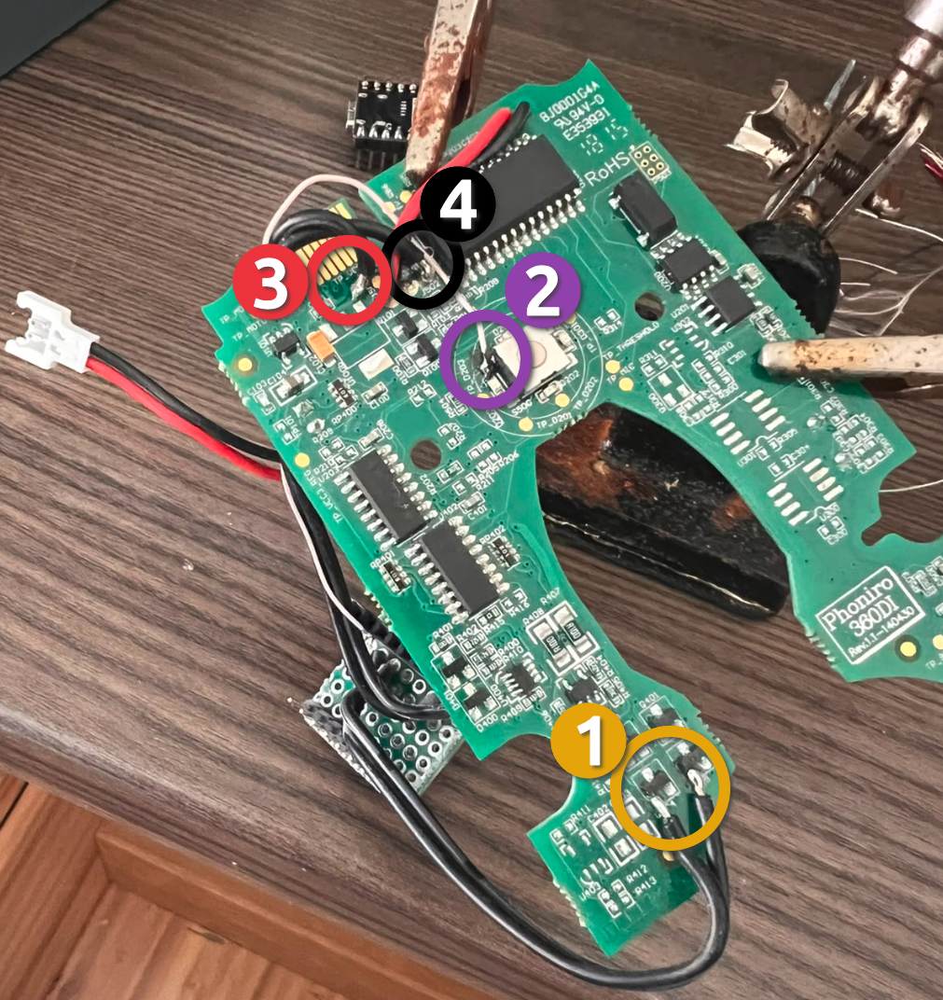

# Glue GL11102B — ESPHome MQTT Door Lock Control

An unofficial hardware modification for the discontinued Glue GL11102B smart lock, using an ESP32-C3 and MQTT to integrate the lock with Home Assistant, Node-RED, or other MQTT-based systems.

The original Glue cloud service is no longer available. This project replaces the lock's original controller functionality with an ESP32-C3 running ESPHome while retaining the original BLE module for battery monitoring.

**This project is not affiliated with, endorsed by, or supported by Glue.**

## What You Need

- **Glue GL11102B** (any condition — BLE chip stays in place)
- **ESP32-C3 Super Mini** (or compatible ESP32-C3)
- [Mosquitto](https://mosquitto.org/) or any MQTT broker
- **ESPHome** 

## PCB Solder Points

See the photo below. The 4 numbered solder points are marked directly on it:

1. Motor terminals
2. Button terminal
3. VCC (3.3V), self regulated from the lock 
4. GND



## Pinout (ESP32-C3)

| Pin   | Function            | Lock connection     | PCB pad |
|-------|---------------------|---------------------|---------|
| GPIO0 | Button input        | Button terminal     | Pad #2  |
| GPIO1 | Motor B (unlock)    | Motor terminals     | Pad #1  |
| GPIO2 | Motor A (lock)      | Motor terminals     | Pad #1  |
| VIN   | VCC (3.3V)          | TP_VCC              | Pad #3  |
| GND   | Ground              | Common ground       | Pad #4  |


## MQTT Topics

| Topic              | Direction | Payload    | Description         |
|--------------------|-----------|------------|---------------------|
| `glue-lock/command`| In        | `"LOCK"`   | Lock the door       |
| `glue-lock/command`| In        | `"UNLOCK"` | Unlock the door     |

### Battery monitoring note

Battery status currently flows via Home Assistant polling the lock's original BLE module over GATT (opcode `0x57`). This requires a Bluetooth proxy in HA.

## Project Structure

```
├── esp/                # ESPHome firmware (published)
│   ├── glue-lock.yaml  # Main firmware config
│   ├── secrets.yaml.example
├── docs/               # Reference photos and images
│   └── glue-lock-pcb.png
├── README.md
└── .gitignore
```

## What Else Could Be Done

A few things are already wired but unused in the current firmware:

- **Button input (GPIO0)** — the circuit is soldered to Pad #2. It could be used as a hardware kill-switch: long-press stops accepting MQTT commands, short-press releases. Useful for physical tamper protection.
- **Battery sensing from ESP32** — instead of relying on HA's BLE poll, you could tap the 7.2V battery rail through a voltage divider into an ESP32 ADC pin and publish `glue-lock/battery/voltage` via MQTT directly. The ESP32-C3 has limited usable ADC pins (GPIO0 is taken), so this may need an external I²C ADC chip or careful pin selection.
- **LED feedback** — the PCB has LED test points (TP_D201, TP_D202, TP_D301) driven through a 74LV595A shift register. Controlling them from the ESP would give visual lock/unlock status at the door. Tracing the SPI lines to the shift register is needed before wiring up.

---

## Safety Notes

### ⚠️ Disclaimer

Use this project at your own risk.

Modifying the lock involves soldering and electrical work and may damage the lock, ESP32, battery, PCB, or other components if performed incorrectly. The information in this repository is provided without any guarantee that the modification will work with every unit or installation.

The motor control timing is based on testing with the author's lock. **Verify the required motor run time for your own lock before relying on the modification for normal operation.**

- Motor run time currently defaults to 7 seconds forward + 1 second reverse.
- Use an appropriate motor driver stage; do not connect the motor directly to ESP32 GPIO pins.
- The original BLE module remains installed for battery monitoring.
- The ESP32-C3 uses 3.3 V logic.
- The lock's battery can provide substantially higher voltage than the ESP32 GPIO level; verify voltages before connecting anything.

## Reverse Engineering

This project documents observations made while examining and modifying the Glue GL11102B hardware and its communication interfaces. It does not distribute the original Glue firmware or proprietary software.

The goal is to document a hardware modification that allows owners of otherwise-discontinued hardware to continue using their device locally.
```
